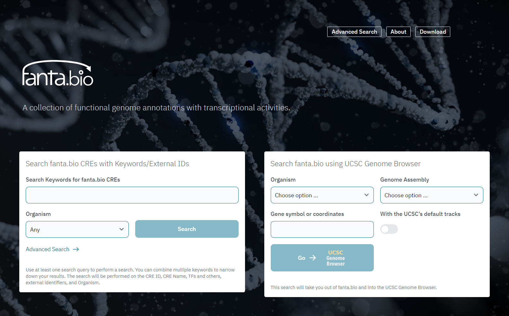
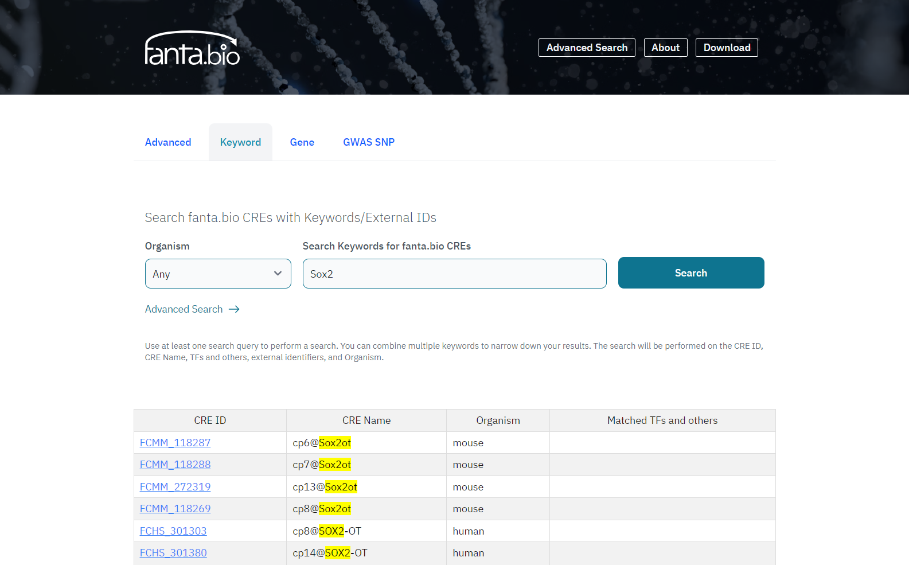
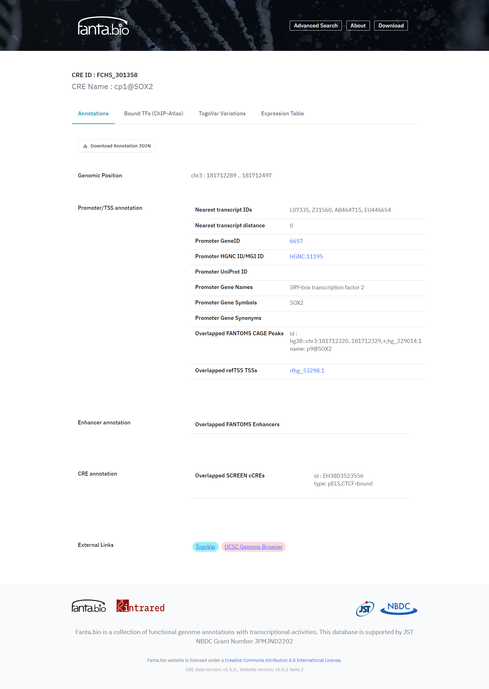
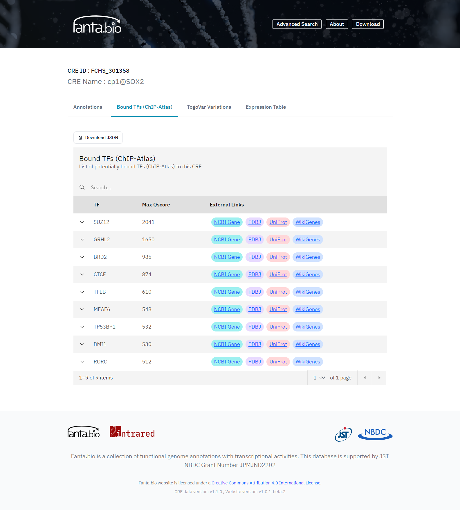
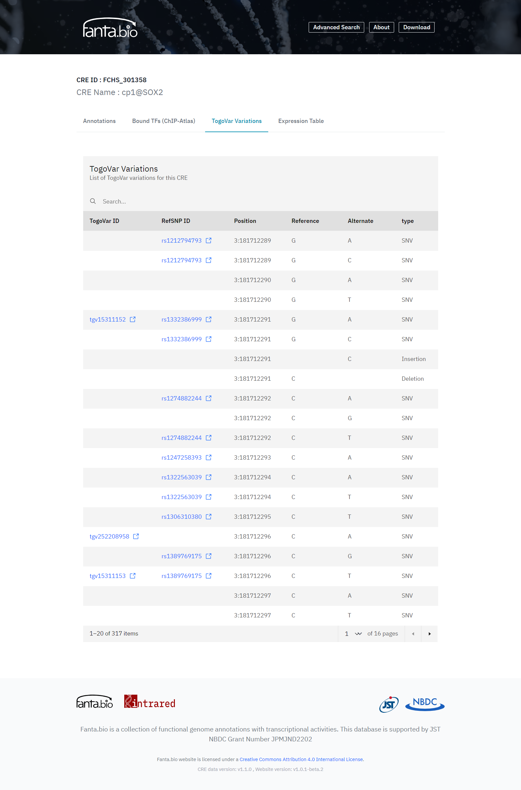
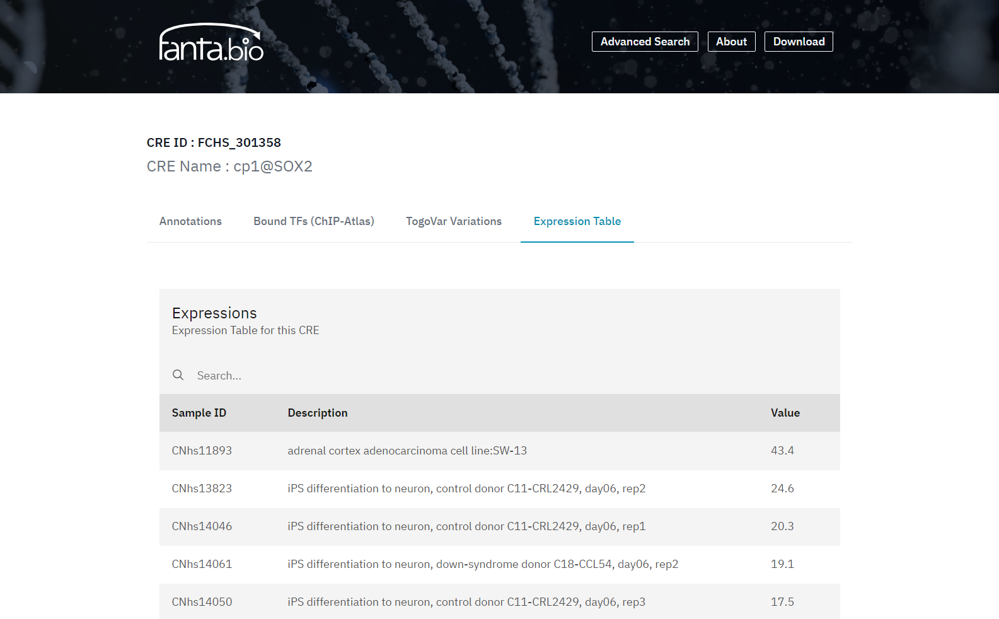
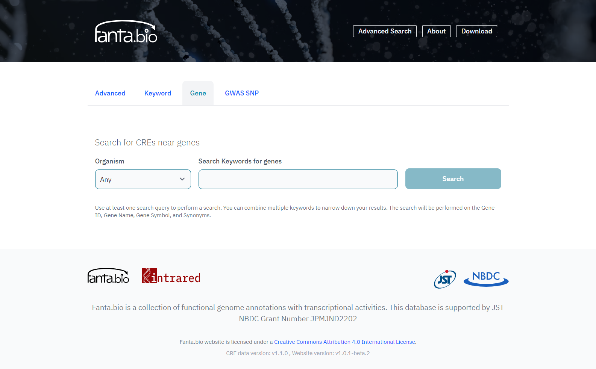
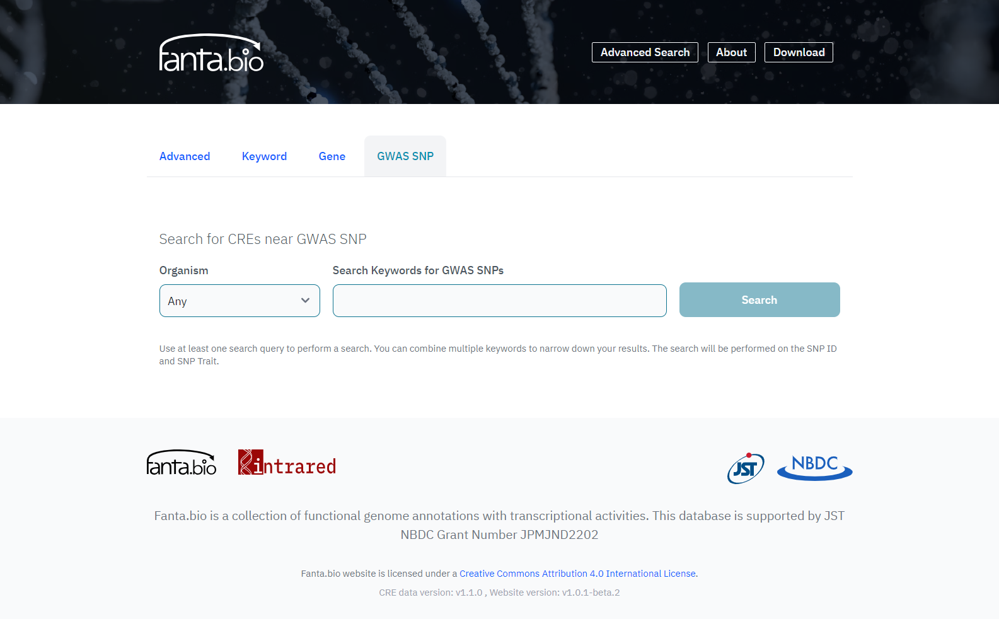

The [fanta.bio](https://fanta.bio/) website is the primary interface for exploring functional genome annotations. This guide walks through the search forms, CRE record pages, and advanced search features.

## Search forms

On the homepage there are two frames to search CREs (cis-regulatory elements) — the in-house interface (left form) and the UCSC Genome Browser (right form) (**Figure 1**). The left form accepts Keywords of CRE ID, CRE Name, TFs and others, and external identifiers, and Organism (Human, Mouse, or Any). The right form accepts Keywords or genomic coordinates that accept in the UCSC Genome Browser, Organisms (Human or Mouse) and Genome Assembly (hg38 or mm10).

In the left form, the results are shown in a table of CREs (**Figure 2**), and it is downloadable as a CSV file. In the right form, the results are shown in the UCSC Genome Browser site.

## CRE record pages

The basic information of CREs are in the Annotation tab of each CRE record page (**Figure 3**), and each record has information about its coordinate on the genome. We searched for reported transcripts within <500 bp from a CRE region, and if transcript(s) were found, the nearest one was picked out as a related transcript of the CRE as a promoter. For those CREs, the nearest transcript information is provided in the Annotation tab (Figure 3), which consists of Ensemble transcript ID/RefSeq ID/GenBank accession as transcript IDs, distance from the detected TSS to 3'- or 5'-end of the transcript, NCBI Gene ID, HGNC ID/MGI ID, UniProt ID, and Gene Name/Symbol/Synonym from HGNC/MGI. To compare the TSS position with other TSS data, overlapped with FANTOM5 CAGE peaks and those with refTSS that is our reference transcript start site database are also shown in the Annotation tab. To presume CRE type, we provide the information on CREs overlapped with FANTOM5 enhancers and overlapped with SCREEN cCREs.

To have additional information about the CRE regions in fanta.bio, information on binding sites of transcription factors is added. The positions of binding sites of transcription factors are extracted from [ChIP-Atlas](https://chip-atlas.org/). In the “Bound TFs (ChIP-Atlas)” tab of a CRE record page (**Figure 4**), TFs experimentally detected to bind to the CRE region by ChIP-seq etc. are listed with Max Qscore (-10 * Log10[MACS2 Q-value]) for the assured peak call. Determination of a transcription factor binding to a CRE region is defined as either CRE region or transcription factor binding region has 50% overlap with the other (peak cutoff: Q-score > 1000). All experiment information (SRA ID) and Qscores for the antigens are shown in the hidden tab at the left side of each antigen name in the list. To search CREs located near a transcription factor binding sites, the "Advanced" search box in the "Adcanced" page can be used, which accepts a transcription factor names in ChIP-Atlas. Search terms in these boxes are allowed exact or partial matches, wildcards, and logical combinations of multiple criteria.

Genome variation data are of medical importance for human because the malfunction of CREs have the potential to get disease, so we also provide genome variation data. The genome variation data for human on our identified CRE regions are collected from [TogoVar](https://togovar.org/) and shown them in "TogoVar Variations" tab of the CRE record page (Figure 5), For mouse, there is a link in the “Annotation” tab of the CRE record page to the relative region of the CRE in the [MoG+](https://molossinus.brc.riken.jp/), which covers various mouse strains, so the data should show us genome variations on CREs that lead to the trait in each mouse strain.

In the Expression Table tab of the CRE record page (Figure 4), a list of CRE expression value in each sample is shown. CRE expression values are quantified by amounts of their transcript per cell or tissue type in the following way; 5'-ends of transcripts within each CRE region are counted, normalized as CPM (counts per million), and scaled by the RLE method (Anders et al. 2013) for sample-wise comparison. Those expression data will help to understand cell-dependent gene regulation that required expression of a specific set of CREs.

## Advanced search

By clicking the "Advanced" button in the top page, users can go to [the page for advanced searches](https://fanta.bio/search/cre-advanced). Three additional search function are provided in it. One is [advanced search](https://fanta.bio/search/cre-advanced), in which users can search for CREs with the combination of CRE ID/Name, Bound TFs, and IDs in external databases. The second is [neighbor gene search (in the "Gene" tab)](https://fanta.bio/search/gene), which is a search function for CREs near a gene (Figure 7). The target items of this search are Gene name, Gene Symbol, and Synonyms, and the results are listed by Gencode Gene IDs. Once a gene ID is selected, a list of CREs located near the selected gene will be appeared. CREs and distance from those CREs to the 3'- or 5'-end of query gene are shown in the list. CREs within 10 kb distance from 3'- or 5'-end of the query gene are considered as near one. If a CRE is in the gene region, distance is displayed as zero. 

The other is [GWAS SNP search](https://fanta.bio/search/snp), which is a search function for CREs near SNPs (Figure 8). We collected trait annotations of GWAS SNPs from [GWAS Catalog](https://www.ebi.ac.uk/gwas/home), and the terms in the trait annotations are used as targets for the query in the SNP search. So, the query terms in this search can be any terms related with traits. The results are shown in a SNP list that consists of SNP ID, Organism, Genomic Position, Trait and CRE Count. Same as the neighbor gene search, CREs within 10 kb distance from 3'- or 5'-end of a SNP are considered as near one, and counted. Selection of a SNP ID leads to show a list of CREs located near the SNP. 

